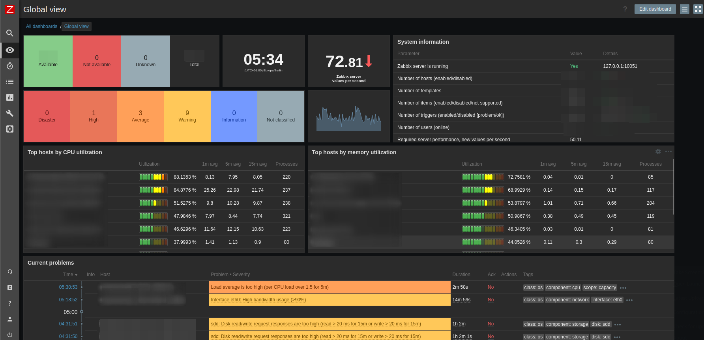
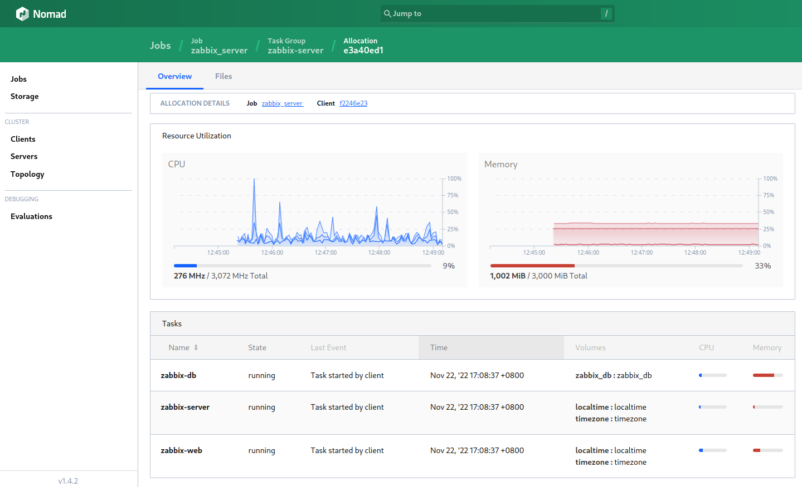

# Nomadic Zabbix Server v6.2

I have been using [Docker-Compose to deploy the Zabbix Server environment](https://github.com/mpolinowski/zabbix-server-compose). But I would like to move this into my Nomad/Consul cluster. Following is the "translation" of the [docker-compose file](https://github.com/mpolinowski/zabbix-server-compose/blob/master/docker-compose.yml) into a Nomad job.


> There is still __one shortcut__ in here - I have not yet setup Consul to help me connecting all my service (_TODO_). So I am running this with `network_mode=host` and connect all components over _127.0.0.1_.


<!-- TOC -->

- [Nomadic Zabbix Server v6.2](#nomadic-zabbix-server-v62)
  - [Images used](#images-used)
  - [Run in Nomad](#run-in-nomad)
    - [Ports used](#ports-used)
    - [Environment Variables](#environment-variables)
  - [Nomad Job](#nomad-job)

<!-- /TOC -->


## Images used

* `zabbix/zabbix-server-pgsql:6.2-alpine-latest`
* `zabbix/zabbix-web-nginx-pgsql:6.2-alpine-latest`
* `postgres:15-alpine3.16`


## Run in Nomad

Run `nomad plan zabbix-server.tf` to provision the service to your data center `dc1` -


### Ports used

* `web_front = 8080` (Zabbix frontend - sign-in with default `Admin`/`zabbix`)
* `server_active = 10051` (Port used for active checks)
* `postgres_db = 5432` (Database port)


### Environment Variables

* `POSTGRES_USER = zabbix`
* `POSTGRES_PASSWORD = mydbpassword`
* `POSTGRES_DB = zabbix`
* `DB_SERVER_HOST = 127.0.0.1`
* `ZBX_JAVAGATEWAY_ENABLE = false`
* `ZBX_ENABLE_SNMP_TRAPS = false`
* `ZBX_CACHESIZE = 128M`
* `ZBX_HISTORYCACHESIZE = 128M`
* `ZBX_HISTORYINDEXCACHESIZE = 128M`
* `ZBX_TRENDCACHESIZE = 128M`
* `ZBX_VALUECACHESIZE = 128M`
* `ZBX_SERVER_HOST = 127.0.0.1`
* `ZBX_SERVER_PORT = 10051`
* `PHP_TZ = Europe/Berlin`








## Nomad Job

```bash
job "zabbix_server" {
    type        = "service"
    datacenters = ["dc1"]

    update {
        max_parallel     = 1
        health_check     = "checks"
        min_healthy_time = "180s"
        healthy_deadline = "5m"
        progress_deadline = "10m"
        auto_revert = true
        auto_promote = true
        canary = 1
    }

    group "zabbix-server" {
        count = 1

        network {
            mode = "host"
            port "server_active" {
                static = 10051
            }
            port "postgres_db" {
                static = 5432
            }
            port "web_front" {
                static = 8080
            }
        }

        volume "localtime" {
            type      = "host"
            read_only = true
            source    = "localtime"
        }

        volume "timezone" {
            type      = "host"
            read_only = true
            source    = "timezone"
        }

        volume "zabbix_db" {
            type      = "host"
            read_only = false
            source    = "zabbix_db"
        }


        task "zabbix-server" {
            driver = "docker"
            kill_timeout = "600s"
            kill_signal = "SIGTERM"

            config {
                network_mode = "host"
                image = "zabbix/zabbix-server-pgsql:6.2-alpine-latest"
                force_pull = false
                ports = ["server_active"]
                volumes = [
                    "local/zabbix/zbx_env/usr/lib/zabbix/alertscripts:/usr/lib/zabbix/alertscripts",
                    "local/zabbix/zbx_env/usr/lib/zabbix/externalscripts:/usr/lib/zabbix/externalscripts",
                    "local/zabbix/zbx_env/var/lib/zabbix/export:/var/lib/zabbix/export",
                    "local/zabbix/zbx_env/var/lib/zabbix/modules:/var/lib/zabbix/modules",
                    "local/zabbix/zbx_env/var/lib/zabbix/enc:/var/lib/zabbix/enc",
                    "local/zabbix/zbx_env/var/lib/zabbix/ssh_keys:/var/lib/zabbix/ssh_keys",
                    "local/zabbix/zbx_env/var/lib/zabbix/mibs:/var/lib/zabbix/mibs",
                ]

            ulimit {
                nofile = "40000"
                nproc = "65535"
                }
            }
            
            env {
                POSTGRES_USER = "zabbix"
                POSTGRES_PASSWORD = "mydbpassword"
                POSTGRES_DB = "zabbix"
                DB_SERVER_HOST = "127.0.0.1"
                ZBX_JAVAGATEWAY_ENABLE = "false"
                ZBX_ENABLE_SNMP_TRAPS = "false"
                ZBX_CACHESIZE = "128M"
                ZBX_HISTORYCACHESIZE = "128M"
                ZBX_HISTORYINDEXCACHESIZE = "128M"
                ZBX_TRENDCACHESIZE = "128M"
                ZBX_VALUECACHESIZE = "128M"
            }

            volume_mount {
                volume      = "localtime"
                destination = "/etc/localtime" #<-- in the container
                read_only   = false
            }

            volume_mount {
                volume      = "timezone"
                destination = "/etc/timezone" #<-- in the container
                read_only   = false
            }

            resources {
                cpu    = 1024
                memory = 1000
            }
        }

        task "zabbix-db" {
            driver = "docker"

            config {
                network_mode = "host"
                image = "postgres:15-alpine3.16"
                force_pull = false
                ports = ["postgres_db"]

                ulimit {
                    nofile = "40000"
                    nproc = "65535"
                }
            }

            service {
                name = "zabbix-server-db"
                check {
                    name     = "postgres-tcp"
                    port     = "postgres_db"
                    type     = "tcp"
                    interval = "30s"
                    timeout  = "4s"
                }
            }

            env {
                POSTGRES_USER = "zabbix"
                POSTGRES_PASSWORD = "mydbpassword"
                POSTGRES_DB = "zabbix"
            }

            volume_mount {
                volume      = "zabbix_db"
                destination = "/var/lib/postgresql/data" #<-- in the container
                read_only   = false
            }

            resources {
                cpu    = 1024
                memory = 1000
            }
        }

        task "zabbix-web" {
            driver = "docker"

            config {
                network_mode = "host"
                image = "zabbix/zabbix-web-nginx-pgsql:6.2-alpine-latest"
                force_pull = false
                ports = ["web_front"]

                ulimit {
                    nofile = "40000"
                    nproc = "65535"
                }
            }

            service {
                name = "zabbix-server-http"
                port = "web_front"

                check {
                    name     = "HTTP Health"
                    port = "web_front"
                    path     = "/"
                    type     = "http"
                    protocol = "http"
                    interval = "10s"
                    timeout  = "2s"
                }
            }

            env {
                POSTGRES_USER = "zabbix"
                POSTGRES_PASSWORD = "mydbpassword"
                POSTGRES_DB = "zabbix"
                PHP_TZ = "Europe/Berlin"
                DB_SERVER_HOST = "127.0.0.1"
                DB_SERVER_PORT = "5432"
                ZBX_SERVER_HOST = "127.0.0.1"
                ZBX_SERVER_PORT = "10051"
            }

            volume_mount {
                volume      = "localtime"
                destination = "/etc/localtime" #<-- in the container
                read_only   = false
            }

            volume_mount {
                volume      = "timezone"
                destination = "/etc/timezone" #<-- in the container
                read_only   = false
            }

            resources {
                cpu    = 1024
                memory = 1000
            }
        }
    }
}
```
